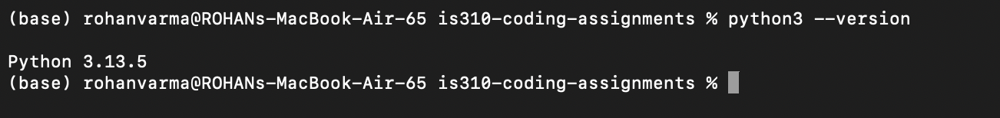
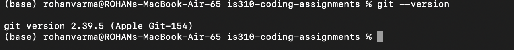
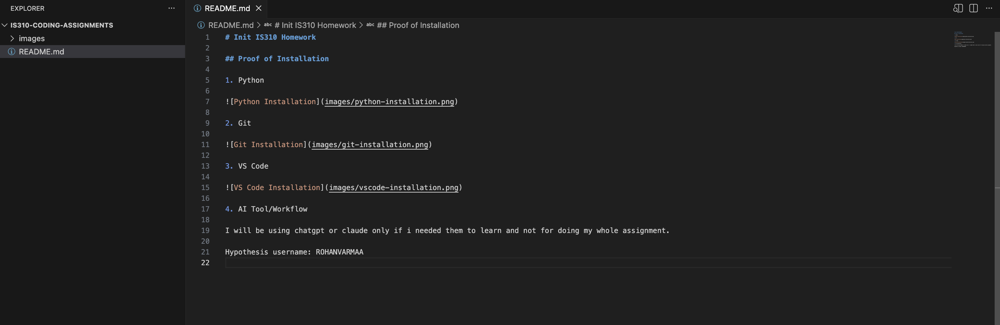

# Init IS310 Homework

## Proof of Installation

1. Python

2. Git

3. VS Code

4. AI Tool/Workflow

I will be using chatgpt or claude only if i needed them to learn and not for doing my whole assignment.

Hypothesis username: rg39